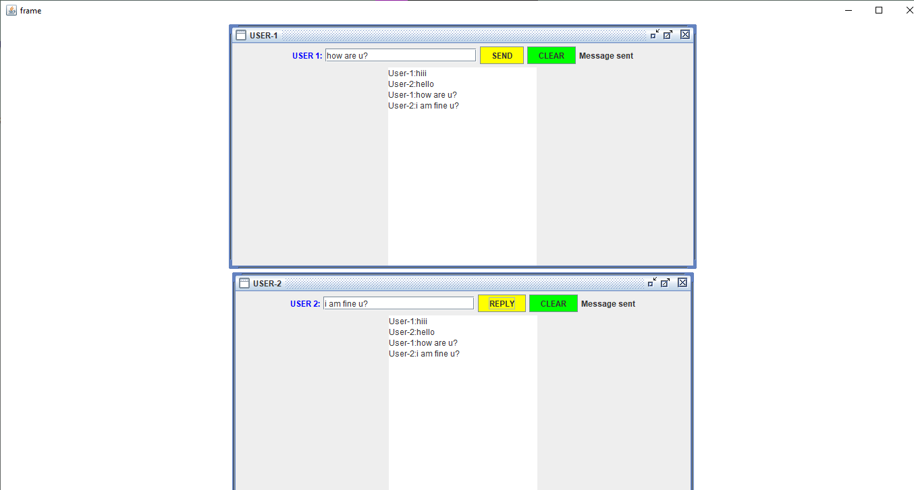

# chat-box-using-java

 Simple chat application where the tho user interact between each other. Implemented using java using eclipse IDE

### Execution
****

- We need to have Eclipse  IDE installed in the System.
- We need to install latest JDK.

### Application user interface
****

Thank you...

